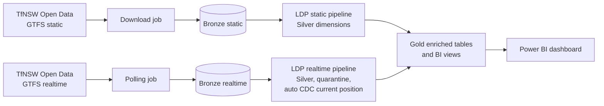

# TfNSW Transit Lakehouse

A Databricks lakehouse for Sydney Trains GTFS data (static timetables and realtime vehicle positions and trip updates) from Transport for NSW Open Data. It follows a medallion design on Unity Catalog, uses Lakeflow Declarative Pipelines (LDP), is deployed with Databricks Asset Bundles, provisioned with Terraform, and promoted through gated CI/CD.

> Contributions are not open at this time.

## What it does

- **Static GTFS (daily refresh):** a job downloads the GTFS static feed into a landing volume, then an LDP pipeline builds Bronze and Silver for routes, trips, stops and the other static entities.
- **Realtime (polling):** a job polls the GTFS-realtime feeds into Bronze, then an LDP pipeline builds Silver (with data-quality expectations and quarantine tables) and Gold.
- **Current position:** the latest position per vehicle uses LDP auto CDC (SCD Type 1), keyed on vehicle and sequenced by position timestamp, so a late-arriving stale row can never overwrite a newer one.
- **Gold and BI:** enriched vehicle-position and trip-delay tables plus BI views feed a Power BI dashboard.

## Architecture

## Repository layout

| Path | Contents |
|---|---|
| `databricks.yml`, `resources/` | Asset Bundle config: static and realtime jobs and pipelines, and the test-suite job |
| `ldp_pipelines/` | LDP pipeline code for static and realtime |
| `utils/` | Pure transform functions used by the pipelines and unit tests |
| `commonsetup/` | One-time environment provisioning and shared config notebooks |
| `download/`, `ingestion/` | GTFS download and Bronze ingestion notebooks |
| `notebooks/` | Earlier notebook-based Silver and Gold implementations (see Evolution) |
| `tests/` | `unit`, `integration` and `e2e` tiers, run on Databricks by `runtests.ipynb` |
| `terraform/` | Azure infrastructure |
| `.github/` | Workflows for each gate, and exported branch rulesets |
| `powerbi/` | Dashboard (`.pbix`) and a PDF snapshot |
| `docs/` | Sample variable overrides and Power BI dashboard snapshot |

## Environments and promotion gates

Work moves `develop` → `staging` → `main`, and each hop is gated by a different test tier:

| Event | Gate | What runs |
|---|---|---|
| Push to `develop` | Unit tests | Pure transform tests |
| Pull request into `staging` | Integration tests | Silver upsert and the CDC "latest position wins" invariant, run against the real pipeline |
| Pull request into `main` | End-to-end tests | The static job, then the realtime job, then checks that the Gold tables and BI views are queryable |

Branch rulesets (exported in `.github/rulesets/`) require pull requests, merge commits only, and the integration and e2e checks to pass, with no bypass actors. The bundle has `dev`, `staging` and `prod` targets, each with its own Unity Catalog catalog. GitHub environments hold the per-stage secrets.

## Infrastructure

Terraform provisions the resource group, an ADLS Gen2 storage account, a Databricks access connector, a Premium (serverless) Databricks workspace, a Key Vault (RBAC authorisation, purge protection), Log Analytics with diagnostic settings, and a Network Security Perimeter. The perimeter enforces access to Key Vault; storage association is currently in transition (learning) mode.

## Getting started

1. Apply the Terraform in `terraform/` (copy your values into a git-ignored `terraform.tfvars`).
2. Copy `docs/variable-overrides.json` to `.databricks/bundle/<target>/variable-overrides.json` and fill in your workspace host, storage account name and notification email.
3. Run `commonsetup/00 provision environment` once per environment. It creates the catalog, schema and the landing and checkpoint volumes.
4. `databricks bundle deploy -t dev`
5. Run the static job, then the realtime job.

New environments need step 3 first: the pipelines and tests assume the schema and volumes exist.

## Testing

- **Unit:** the transform functions in `utils/`, with no cluster dependency beyond Spark.
- **Integration:** seeds Bronze with a newer and a stale row for a uniquely named test vehicle, runs one realtime LDP pipeline update through the Databricks SDK, then checks that the update completed, both rows reached Silver, the current table holds exactly one row for the vehicle, and that row is the newer position. The tests never delete anything. The tier starts by running the static and realtime jobs, so it works on a fresh environment.
- **End-to-end:** runs both jobs fully and checks the Gold tables and BI views.

## Design decisions

- **Bronze is append-only by convention.** No dedup, MERGE or overwrite; a duplicate or corrected row is just another row. Dedup happens in Silver. Enforcement at the table level is planned (see Known gaps).
- **Streaming reads fail loudly on source changes.** Silver and Gold read their sources with plain streaming reads, so a delete or update in a source fails the stream instead of being skipped silently. The trade-off is that a legitimate delete, such as an erasure request, needs a controlled full refresh downstream.
- **Bad rows are quarantined, not dropped.** Named expectations route rows (for example, a vehicle position with no coordinates) to `_quarantine` tables with the original payload intact.
- **Current position uses auto CDC.** The latest position per vehicle is decided by position timestamp, not arrival order, and the integration tier proves it.
- **Gold joins are LEFT joins.** An unscheduled trip often has no static record; that is normal GTFS, so it still produces a row with nulls.
- **One table per entity, with a `gtfs_mode` column.** Adding buses later is a filter, not a UNION. Only Sydney Trains is active today.

## Engineering notes

Things that went wrong on the way to a green `main`, and what they changed:

1. **Stale bundle state produced a destructive plan on staging.** A pipeline that no longer existed in the bundle was still in deployment state. I approved the plan locally after checking that only that pipeline was deleted, and CI never uses auto-approve.
2. **The integration tier depended on tables built elsewhere.** The CDC test needed static and realtime tables that only the pipelines create, so it failed on a clean environment. Fix: the integration tier now runs the static and realtime jobs first (a deliberate copy of the e2e tests; a fixture that builds only what is missing is on the backlog).
3. **A test fixture deleted rows from streaming sources.** The integration test cleaned up its synthetic vehicle by deleting rows from Bronze and Silver, which are streaming sources, and a Delta stream fails when its source has a delete commit (`DELTA_SOURCE_IGNORE_DELETE`). `DESCRIBE HISTORY` showed the `DELETE` on the Bronze table. The first run after a rebuild passed, because no delete commit existed yet; every later run failed. I first worked around it with `skipChangeCommits`, then removed that, since it would hide a real violation of an append-only Bronze. The tests now seed a uniquely named vehicle and never delete. Separately, pipeline updates and deploys do not queue behind a running update, while jobs do; planned prevention is a workflow `concurrency` group.

## Decisions made for a solo, scaled-down build

- One workspace with separate catalogs per stage, not separate workspaces.
- Personal access token for CI, not a service principal with OIDC.
- No required reviewers between stages (solo project).
- Network Security Perimeter instead of VNet injection or Private Link. Private endpoints are the production path I would take next.
- The realtime Bronze layer is a polling notebook, with LDP for Silver and Gold. An experimental LDP-native Bronze variant is kept in `ldp_pipelines/realtime/bronze.py`; replacing the polling notebook with it is a planned next step.
- The workspace host is committed in `databricks.yml` deliberately, so a misconfigured CI variable cannot send a deploy to another workspace. It is an identifier, not a credential; access needs Entra authentication.
- Job tasks run with `max_retries: 0`: a deterministic failure just repeats on retry, so a failing run should fail fast and alert.

## Known gaps

- Buses are not active; the schema is mode-aware, so adding them is a planned extension.
- Environment provisioning is a manual notebook run; moving it into Terraform and the bundle is a planned step.
- The storage account's Network Security Perimeter association is in learning mode, not Enforced.
- A fully LDP-native Bronze for realtime is a planned next step.
- The static timetable comes from the v1 "Timetables - For Realtime" dataset. TfNSW has published a v2 (the v1 Metro endpoint is marked superseded); moving the Sydney Trains download to v2 is a planned check.
- Bronze append-only is a convention, not yet enforced. The planned fix is `delta.appendOnly` on the realtime Bronze table plus write access limited to the ingestion identity.
- Integration tests share the staging catalog, and their synthetic vehicles (the `TEST_V_CDC_` prefix) stay in staging Bronze. A dedicated test environment is planned.

## Evolution

The notebooks under `notebooks/` are the original notebook-orchestrated Silver and Gold implementations. Static Silver used a hash-diff MERGE (hash the business columns, and touch a row only if its hash changed); real-time Silver was append-only on a checkpoint. They were replaced by the LDP pipelines and are kept as reference for how the design evolved.

## Dashboard

The report is interactive: selecting a vehicle or route cross-filters the map, the KPI tiles and the charts. The data is cached in the file, so you can open `powerbi/tfnsw_dashboard.pbix` in Power BI Desktop and explore it without a Databricks connection. Refreshing the report requires access to the Databricks workspace.

Full PDF: [`powerbi/dashboard_snapshot.pdf`](powerbi/dashboard_snapshot.pdf)

## Data and attribution

This project uses data from [Transport for NSW Open Data Hub](https://opendata.transport.nsw.gov.au/), licensed under the [Creative Commons Attribution 4.0 International licence (CC BY 4.0)](https://creativecommons.org/licenses/by/4.0/), under the Hub's terms.

Datasets used (Sydney Trains feeds only; the datasets also cover other modes that this project does not use):

- [Public Transport - Timetables - For Realtime](https://opendata.transport.nsw.gov.au/data/dataset/b4b3601a-93f8-4ab8-8482-f73029a59f53) (static GTFS)
- [Public Transport - Realtime Vehicle Positions API v2](https://opendata.transport.nsw.gov.au/data/dataset/f3da2c60-6cb9-4712-a8e7-403f5cdbe5f3) (GTFS-realtime vehicle positions)
- [Public Transport - Realtime Trip Update API v2](https://opendata.transport.nsw.gov.au/data/dataset/868860ea-feb0-4602-adde-f6b4ba48d738) (GTFS-realtime trip updates)

The data has been transformed in this project (ingested into Bronze, cleaned and conformed in Silver, and enriched in Gold). This is a personal learning project. It is not affiliated with, endorsed by, or sponsored by Transport for NSW or any other transport agency.
